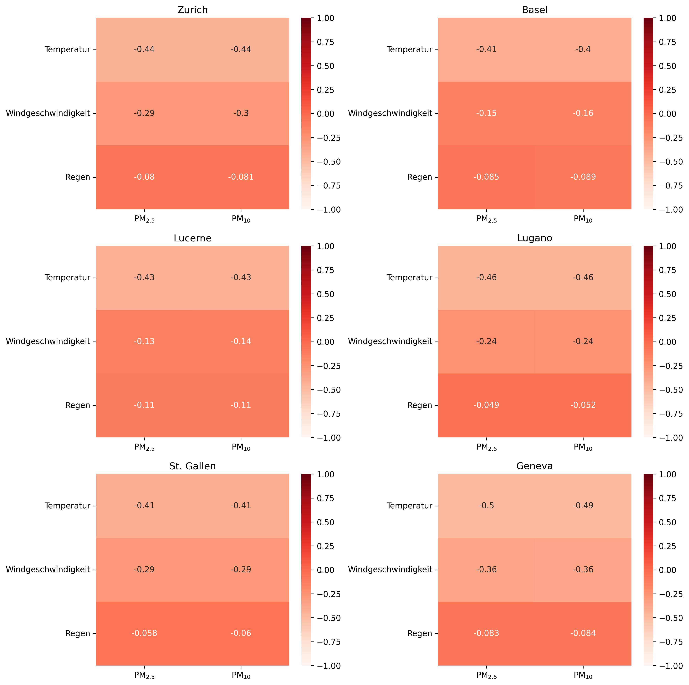
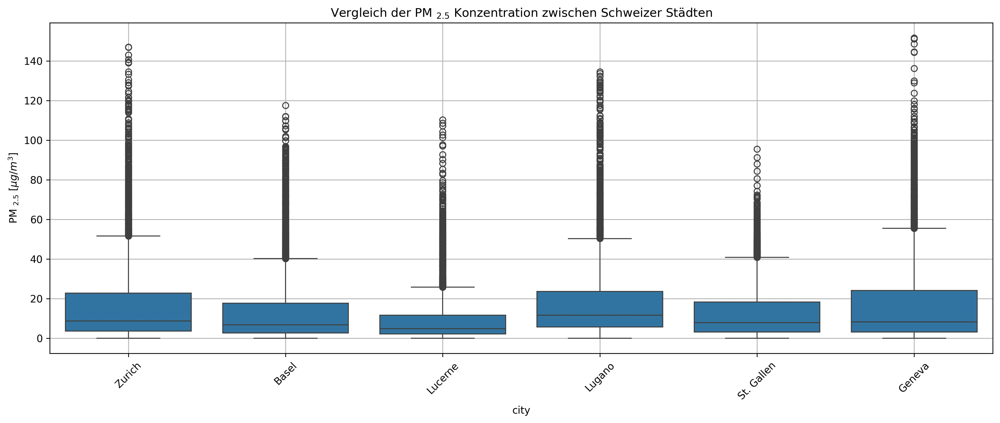
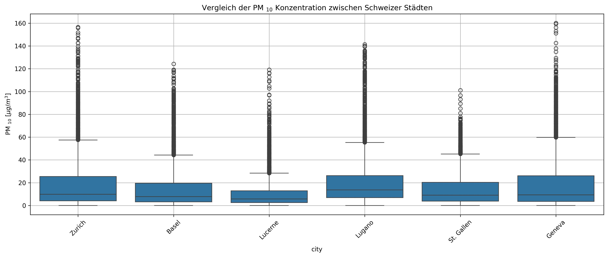
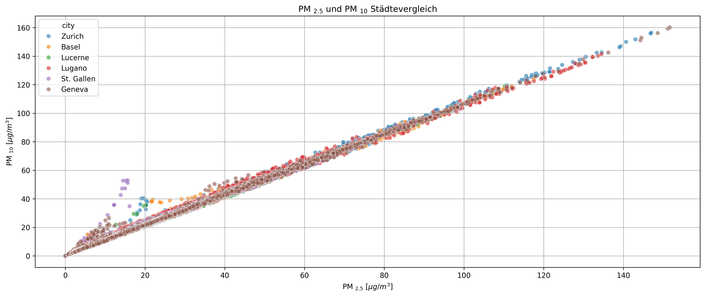

# Data-Centric Programming Study Project: Weather and Air Pollution Analysis

Public portfolio version of a group study project. Personal data, API credentials and internal course material have been removed.

This notebook analyses hourly weather and air pollution data for selected Swiss cities. The project was completed as a group assignment in a data-centred programming study project in the BSc Applied Digital Life Sciences at Zurich University of Applied Sciences (ZHAW).

The analysis focuses on Zurich, Basel, Lucerne, Lugano, St. Gallen and Geneva for the period from June 2024 to May 2025. Weather data such as temperature, wind speed and rainfall are combined with air pollution data for PM2.5 and PM10. The data is retrieved via OpenWeather APIs, cached locally, merged by timestamp and analysed using descriptive statistics, correlation matrices, boxplots, scatterplots and time-series visualisations.

The objective of the project is not to prove strict causality, but to identify observable patterns between meteorological conditions and particulate matter concentrations. The results indicate that temperature and wind speed are more clearly associated with changes in PM levels than rainfall, while PM2.5 and PM10 show a strong positive relationship across the analysed cities.

## Project Objectives

The project demonstrates how API-based environmental data can be collected, processed and analysed in a reproducible Python workflow. In particular, it focuses on:

- collecting historical weather and air pollution data via API
- retrieving geographic coordinates for selected cities
- caching API responses locally to avoid repeated API calls
- merging weather and air pollution data by timestamp
- preparing hourly time-series data for exploratory analysis
- comparing PM2.5 and PM10 concentrations across Swiss cities
- analysing correlations between weather variables and particulate matter concentrations
- visualising environmental data through heatmaps, boxplots, scatterplots and time-series plots
- interpreting observed patterns while distinguishing correlation from causality

## Main Topics

- API-based data acquisition with OpenWeather
- Local caching of pandas DataFrames using pickle files
- Time-series preprocessing and timestamp handling
- Exploratory data analysis of urban air pollution
- Correlation analysis between weather and particulate matter variables
- City-level comparison of PM2.5 and PM10 concentrations
- Visual analysis of seasonal patterns in air pollution
- Interpretation of meteorological effects on air quality
- Communicating analytical results through clear visualisations

## Tools and Libraries

- Python
- Jupyter Notebook
- pandas
- requests
- Matplotlib
- Seaborn
- IPython display utilities

## Notebook

The main analysis is contained in the following notebook:

```text
dcp_study_project_weather_and_air_pollution_analysis.ipynb
```

## API and Data Note

This project uses OpenWeather APIs. To run the notebook, a personal OpenWeather API key is required. The API key must not be committed to GitHub.

The notebook expects a local file named `secret_api_key.csv`. This file is not included in the public repository.

Use the provided example file `secret_api_key.example.csv` as a template and create your own local file with the following structure:

```csv
APIKey
your_api_key_here
```
Save this file locally as: `secret_api_key.csv`

The notebook stores API responses locally as `.pkl` files in the `data/` directory. These files act as a local cache so that the same API requests do not have to be repeated every time the notebook is executed.

No personal data is included in the analysis. Before reusing or redistributing cached API data, the original source and usage rights should be checked.

## Selected Results

The `plots/` folder contains selected visual outputs from the notebook. These figures illustrate the main analytical steps, including city comparisons, correlation analysis and time-series visualisations.

### Correlation Heatmaps



**Figure 1:** Correlation heatmaps showing the relationship between temperature, wind speed and rainfall on the one hand and PM2.5 and PM10 on the other hand for the selected Swiss cities.

### PM2.5 City Comparison



**Figure 2:** Boxplot comparison of hourly PM2.5 concentrations across the analysed cities. The plot highlights differences in central tendency, spread and outliers.

### PM10 City Comparison



**Figure 3:** Boxplot comparison of hourly PM10 concentrations across the analysed cities. The plot shows the distribution and variability of coarse particulate matter concentrations.

### Relationship Between PM2.5 and PM10



**Figure 4:** Scatterplot showing the relationship between PM2.5 and PM10 concentrations. The two particulate matter fractions show a strong positive relationship across the analysed observations.

Additional time-series plots for temperature, rainfall, wind speed and PM2.5 are available in the `plots/` folder.

## Repository Structure

```text
data/
  basel_emission.pkl
  basel_weather.pkl
  geneva_emission.pkl
  geneva_weather.pkl
  lucerne_emission.pkl
  lucerne_weather.pkl
  lugano_emission.pkl
  ...


plots/
  correlation_heatmaps_3x2.jpg
  boxplot_pm2_5_city_comparison.jpg
  boxplot_pm10_city_comparison.jpg
  scatter_pm25_pm10_city_comparison.jpg
  zurich_temperature.jpg
  zurich_rain.jpg
  zurich_wind.jpg
  ...

.gitignore
dcp_study_project_weather_and_air_pollution_analysis.ipynb
example_api_geo.json
README.md
requirements.txt
secret_api_key.example.csv
```

## How to Run

Clone the repository and install the required Python packages:

```bash
pip install -r requirements.txt
```

Create a local API key file:

```text
secret_api_key.csv
```

with the following content:

```csv
APIKey
your_api_key_here
```

Then open the notebook:

```text
dcp_study_project_weather_and_air_pollution_analysis.ipynb
```

Run the notebook cells from top to bottom. If cached `.pkl` files are already available in the `data/` directory, the notebook loads them from disk. Otherwise, the data is retrieved via the OpenWeather APIs and cached locally.

## Limitations

This analysis is exploratory. The observed relationships should be interpreted as correlations and visual patterns, not as direct causal effects. Weather, air pollution and urban emissions are influenced by many interacting factors, including local traffic, heating systems, atmospheric stability, regional transport of pollutants and data availability.

The boxplots and time-series plots are based on hourly data. Direct comparisons with annual or daily air-quality guideline values require separately calculated annual or daily averages.

## Portfolio Note

This repository is intended as a public portfolio version of a group study project. Personal contact details, API credentials, internal course material and non-essential administrative content have been removed.

The project demonstrates applied Python skills in API-based data acquisition, environmental data processing, time-series analysis, data visualisation and the interpretation of real-world urban air-quality data.
